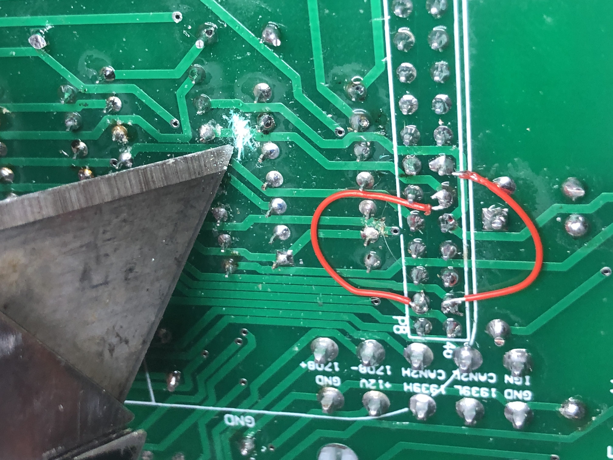
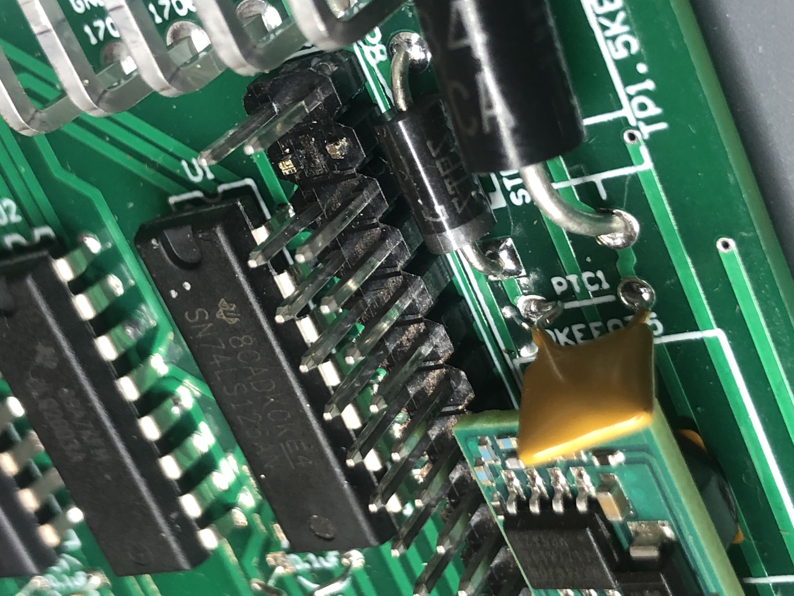

# TruckCape for the Beagle Bone Black

This directory has Altium schematics, printed circuit boards, and PCB project files.

All components are through hole, so it is easy to build with just a soldering iron.

PDFs of the schematics are available. The board in this design is available for version 3 as an OSHPark shared project: https://oshpark.com/shared_projects/FXh7K628

## Errata
The rev 4 board calls for a B82134 Inductor, but that component is too big. Instead, use a B82131 Inductor. The Bill of Materials for v4 accurately reflects this change. 

The bottom silkscreen on the v4 PCB is mislabeled. It should match the schematic and have only 1 common supply (COM) and 4 open collector outputs (low-side switches).

PWM2 and PWM4 signals went to non-PWM pins. These pins were also loaded because the Darlington Array (ULQ2003AN) has a path to ground through the base. Therefore, the BBB won't boot when pins 43 and 44 are driven. These pins need to be cut.



The new pins for PWM2 and PWM3 are P8.34 and P8.36, respectively. However, the PWM6_OUT was tied to P8.36. This signal line needs to be cut. PWM6_OUT also has R11 pulling the signal high. Since this is now an output for PWM3, the pullup resistor needs to be removed. Be sure R11 is not populated.



The handannotated schematic is available 


### Trace Routing and Enclosure Issues
There are traces under the solder mask that coincide with the aluminum rails. This is not a short-term issue, but if the mask is scratched, it could short to the aluminum enclosure. Perhaps a layer of kapton tape could improve the reliability. 

### Testing PWM pins on v4
The following commands will turn on PWM signals:
```
debian@beaglebone:~$ python3
Python 3.7.3 (default, Dec 20 2019, 18:57:59) 
[GCC 8.3.0] on linux
Type "help", "copyright", "credits" or "license" for more information.
>>> import Adafruit_BBIO.PWM as PWM
>>> PWM.start("P8_34",1,5)
>>> PWM.start("P8_36",10,5)
>>> PWM.start("P8_46",20,2)
>>> PWM.start("P8_45",80,2)
```
Each PWM channel needs to have the same frequency.

Pins 34 and 36 comprise channel 1.

Pins 45 and 46 comprise channel 2.